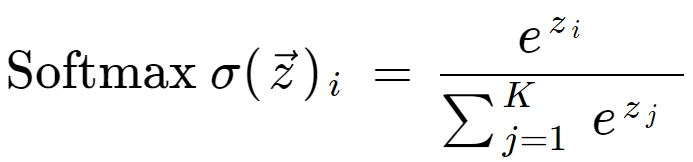
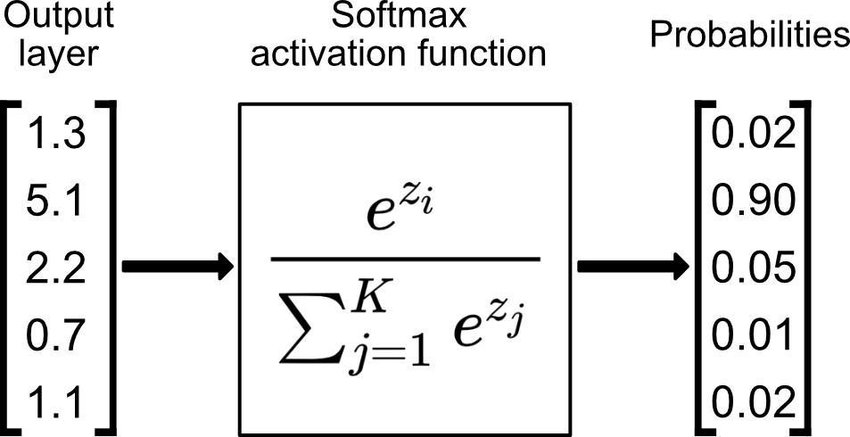
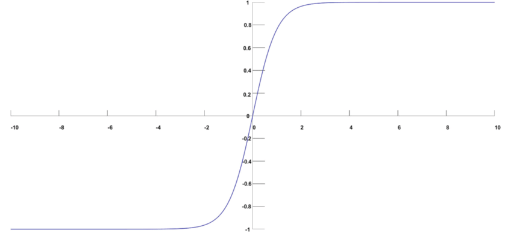
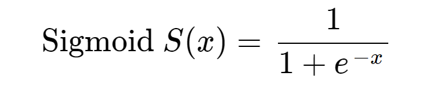
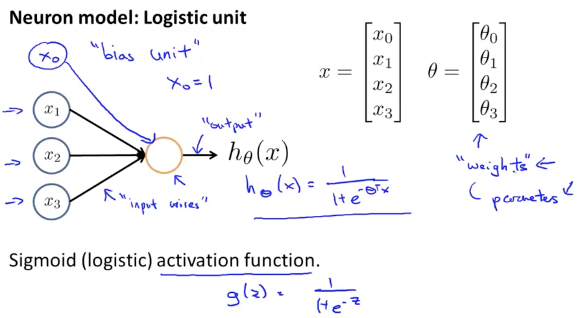
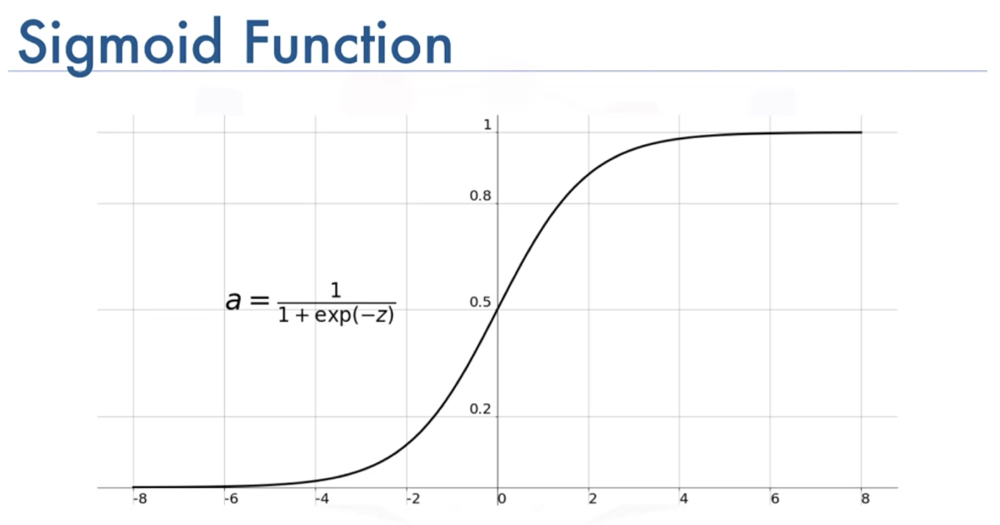
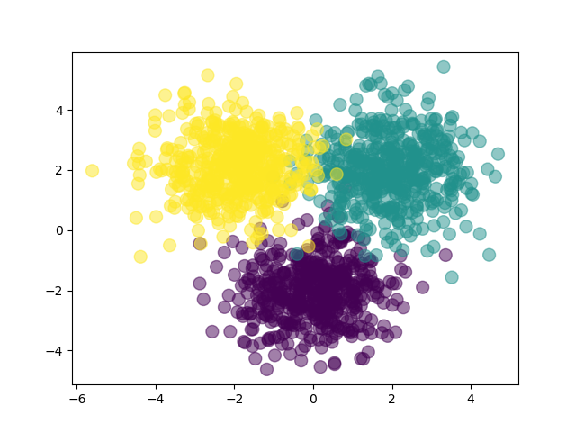

# This repository holds all the programs and resources related to deep learning
## Softmax VS Sigmoid functions
### Softmax :
1. Softmax is used when the number of classes K > 2
2. Softmax equation ->

3. working principles ->

4. Softmax function image ->

### Sigmoid :
1. Sigmoid is used when we have K = 2. In other words we use sigmoid to do binary classification
2. Sigmoid equation ->

3. working principles ->

4. Sigmoid function image ->


## Softmax :
### implementation -->
#### Now as you know we are going to be working with multiple samples at the same time so let's try this again with a matrix. Here we are randomely taking a matrix of 100 samples by 5 categories
```
A = np.random.randn(100,5)
```
#### perform softmax operation on the activation
1. step 1 : exponentiate these activation (So that they are all positive)
2. step 2 : divide by the sum
   ```Now you are gonna have a problem here because you dont want to divide by the whole sum because then the whole thing is gonna sum to 1
      "answer = expA/expA.sum()"
      We want every row to sum to one for each sample. axis=1 means we want to do summision along the row
      "answer = expA/expA.sum(axis=1,keepdims=True)"
   ```

```
expA = np.exp(A)
print(f"activation after exponentiation : {expA}")

#The final result of the softmax
Result = expA/expA.sum(axis=1,keepdims=True)
print(f"step 2 answer after dividing expa/expa.sum(): {Result}")

#You can confirm that the result is a probabilities by adding them up and the sum should be 100 because each row summision should be 1 and there are
#100 samples so the final summision should be -> 100
print(f"You can confirm that the answer is a probabilities by adding them up and the sum should be 1 : {Result.sum()}")

#sum along rows = 1
print(f"sum along rows : {Result.sum(axis=1)}")
```

## Forward function :
### Running predictions on the dataset -
#### Here we are trying to do predictions without training the neural network by randomply selecting the weights for our neural network
```
#Number of inputs
D=2
#Number of hidden layers
M=3
#number of classes
K=3

#initialize the weights
#On the input side
#W1 weight matrix has to be D x M matrix
W1 = np.random.randn(D,M)
#b1 bias term
b1 = np.random.randn(M)
#On the output side
#M2 weight matrix has to be M X K matrix
W2 = np.random.randn(M,K)
#b2 bias term
b2 = np.random.randn(K)
```
#### The data we created is 3 gaussian clouds.
1. np.random.randn(Nclass, 2) + np.array([0,-2]) So the 1st gaussian cloud is gonna centered at 0,-2
2. np.random.randn(Nclass, 2) + np.array([2,2]) So the 2nd gaussian cloud is gonna centered at 2,2
3. np.random.randn(Nclass, 2) + np.array([-2,2]) So the 3rd gaussian cloud is gonna centered at -2,2
```
#let's create 500 samples per class
#So what we are gonna do is generate some gaussian clouds
Nclass = 500
#So we are gonna have 3 gaussian clouds
#np.random.randn(Nclass, 2) + np.array([0,-2]) So the 1st gaussian cloud is gonna centered at 0,-2
X1 = np.random.randn(Nclass, 2) + np.array([0,-2])
#np.random.randn(Nclass, 2) + np.array([2,2]) So the 2nd gaussian cloud is gonna centered at 2,2
X2 = np.random.randn(Nclass, 2) + np.array([2,2])
#np.random.randn(Nclass, 2) + np.array([-2,2]) So the 3rd gaussian cloud is gonna centered at -2,2
X3 = np.random.randn(Nclass, 2) + np.array([-2,2])
X = np.vstack([X1,X2,X3])
```
#### You can easily visualize the data we just created if we plot this on a scatter plot

#### Feed forward function for the neural network that has -->
1. 2 inputs
2. 3 number of hidden layers
3. 3 number of classes
```
#let's define the forward action of the neural network
#It's gonna take in x matrix , W1, b1, W2, b2
def forward(X,W1,b1,W2,b2):
    # we are gonna use sigmoid non linearity in the hidden layers
    #Z is the value at the hidden layer
    # sigmoid(-(a+b1)) --> sigmoid(-a-b1) hence exp(-X.dot(W1)-b1)
    Z = 1/(1+np.exp(-X.dot(W1)-b1))

    #Now we can calculate the softmax of the next layer
    A = Z.dot(W2) +b2
    #we exponentiate A
    expA = np.exp(A)
    #Output Y
    Y = expA/expA.sum(axis=1,keepdims = True)
    return Y
```
#### Function to calculate the classification rate
```
#define a function to calculate the classification rate
#This is gonna take in targets Y and predictions P
def classification_rate(Y,P):
    n_correct = 0
    n_total = 0
    for i in range(len(Y)):
        n_total +=1
        if Y[i]==P[i]:
            n_correct +=1
    return float(n_correct)/n_total
```
#### Python's assert statement allows you to write sanity checks in your code. These checks are known as assertions, and you can use them to test if certain assumptions remain true while you're developing your code. If any of your assertions turn false, then you have a bug in your code
```
assert(len(Predictions)==len(Y))
```
#### The final prediction of this neural network model is : -> As you can see that the prediction is exactly what we expected 1/3. This prediction score is low because we din't train the neural network model as of yet. As you know that training the model means finding the oprtimal weights for the model. But If you recall we did not do that instead we randomly selected weights for our neural network. Hence the result.
```
Classification rate for the randomly chosen weights : 0.3333333333333333
```
### Conclusion :
#### Our goal here was to learn how to do prediction using neural network and not how to train neural network. The score will go up when we eventually train the neural network and run predictions again. 
