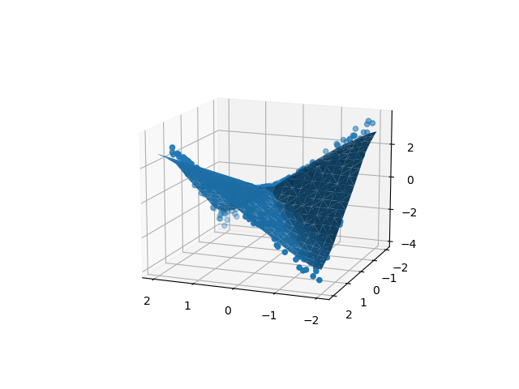

# This repository holds all the programs and resources related to deep learning
## IMPORTANT NOTE : Before we start anything I want to tell you that if you ever want to convert your jupyter notebook into a PDF then run the code below in your linux terminal ->  
```
sudo apt-get install pandoc texlive-xetex
```
## After this go to your jupyter notebook -> Files -> Download as -> PDf via LateX to convert your jupyter Notebook into PDF
## Numpy axis ---->

## Softmax VS Sigmoid functions
### Softmax :
1. Softmax is used when the number of classes K > 2
2. Softmax equation ->

3. working principles ->

4. Softmax function image ->

### Sigmoid :
1. Sigmoid is used when we have K = 2. In other words we use sigmoid to do binary classification
2. Sigmoid equation ->

3. working principles ->

4. Sigmoid function image ->

## Important equations used in a typical neural netoworks when doing multiclass classification->


## Softmax :
### implementation -->
#### Now as you know we are going to be working with multiple samples at the same time so let's try this again with a matrix. Here we are randomely taking a matrix of 100 samples by 5 categories
```
A = np.random.randn(100,5)
```
#### perform softmax operation on the activation
1. step 1 : exponentiate these activation (So that they are all positive)
2. step 2 : divide by the sum
   ```Now you are gonna have a problem here because you dont want to divide by the whole sum because then the whole thing is gonna sum to 1
      "answer = expA/expA.sum()"
      We want every row to sum to one for each sample. axis=1 means we want to do summision along the row
      "answer = expA/expA.sum(axis=1,keepdims=True)"
   ```

```
expA = np.exp(A)
print(f"activation after exponentiation : {expA}")

#The final result of the softmax
Result = expA/expA.sum(axis=1,keepdims=True)
print(f"step 2 answer after dividing expa/expa.sum(): {Result}")

#You can confirm that the result is a probabilities by adding them up and the sum should be 100 because each row summision should be 1 and there are
#100 samples so the final summision should be -> 100
print(f"You can confirm that the answer is a probabilities by adding them up and the sum should be 1 : {Result.sum()}")

#sum along rows = 1
print(f"sum along rows : {Result.sum(axis=1)}")
```

## Forward function :
### Running predictions on the dataset -
#### Here we are trying to do predictions without training the neural network by randomply selecting the weights for our neural network
```
#Number of inputs
D=2
#Number of hidden layers
M=3
#number of classes
K=3

#initialize the weights
#On the input side
#W1 weight matrix has to be D x M matrix
W1 = np.random.randn(D,M)
#b1 bias term
b1 = np.random.randn(M)
#On the output side
#M2 weight matrix has to be M X K matrix
W2 = np.random.randn(M,K)
#b2 bias term
b2 = np.random.randn(K)
```
#### The data we created is 3 gaussian clouds.
1. np.random.randn(Nclass, 2) + np.array([0,-2]) So the 1st gaussian cloud is gonna centered at 0,-2
2. np.random.randn(Nclass, 2) + np.array([2,2]) So the 2nd gaussian cloud is gonna centered at 2,2
3. np.random.randn(Nclass, 2) + np.array([-2,2]) So the 3rd gaussian cloud is gonna centered at -2,2
```
#let's create 500 samples per class
#So what we are gonna do is generate some gaussian clouds
Nclass = 500
#So we are gonna have 3 gaussian clouds
#np.random.randn(Nclass, 2) + np.array([0,-2]) So the 1st gaussian cloud is gonna centered at 0,-2
X1 = np.random.randn(Nclass, 2) + np.array([0,-2])
#np.random.randn(Nclass, 2) + np.array([2,2]) So the 2nd gaussian cloud is gonna centered at 2,2
X2 = np.random.randn(Nclass, 2) + np.array([2,2])
#np.random.randn(Nclass, 2) + np.array([-2,2]) So the 3rd gaussian cloud is gonna centered at -2,2
X3 = np.random.randn(Nclass, 2) + np.array([-2,2])
X = np.vstack([X1,X2,X3])
```
#### You can easily visualize the data we just created if we plot this on a scatter plot

#### Feed forward function for the neural network that has -->
1. 2 inputs
2. 3 number of hidden layers
3. 3 number of classes
```
#let's define the forward action of the neural network
#It's gonna take in x matrix , W1, b1, W2, b2
def forward(X,W1,b1,W2,b2):
    # we are gonna use sigmoid non linearity in the hidden layers
    #Z is the value at the hidden layer
    # sigmoid(-(a+b1)) --> sigmoid(-a-b1) hence exp(-X.dot(W1)-b1)
    Z = 1/(1+np.exp(-X.dot(W1)-b1))

    #Now we can calculate the softmax of the next layer
    A = Z.dot(W2) +b2
    #we exponentiate A
    expA = np.exp(A)
    #Output Y
    Y = expA/expA.sum(axis=1,keepdims = True)
    return Y
```
#### Function to calculate the classification rate
```
#define a function to calculate the classification rate
#This is gonna take in targets Y and predictions P
def classification_rate(Y,P):
    n_correct = 0
    n_total = 0
    for i in range(len(Y)):
        n_total +=1
        if Y[i]==P[i]:
            n_correct +=1
    return float(n_correct)/n_total
```
#### Python's assert statement allows you to write sanity checks in your code. These checks are known as assertions, and you can use them to test if certain assumptions remain true while you're developing your code. If any of your assertions turn false, then you have a bug in your code
```
assert(len(Predictions)==len(Y))
```
#### The final prediction of this neural network model is : -> As you can see that the prediction is exactly what we expected 1/3. This prediction score is low because we din't train the neural network model as of yet. As you know that training the model means finding the oprtimal weights for the model. But If you recall we did not do that instead we randomly selected weights for our neural network. Hence the result.
```
Classification rate for the randomly chosen weights : 0.3333333333333333
```
### Conclusion :
#### Our goal here was to learn how to do prediction using neural network and not how to train neural network. The score will go up when we eventually train the neural network and run predictions again.

## BackPropogation :
#### Diagram of BackPropogation ---->

#### BackPropogation is just a fancy name given to the process of training a neural network but in reality it's nothing but gradient descent. Which is used to find the optimal weights for the neural network
### We are going to create 3 gaussian clouds as our input data points in order to demonstrate back propogation while training the neural networks
#### Here is the code to create three gaussian clouds as an input data --->
```
#let's create 500 samples per class
  #So what we are gonna do is generate some gaussian clouds
  Nclass = 500

  #Number of inputs
  D=2
  #Number of hidden layers
  M=3
  #number of classes
  K=3

  #So we are gonna have 3 gaussian clouds
  #np.random.randn(Nclass, 2) + np.array([0,-2]) So the 1st gaussian cloud is gonna centered at 0,-2
  X1 = np.random.randn(Nclass, D) + np.array([0,-2])
  #np.random.randn(Nclass, 2) + np.array([2,2]) So the 2nd gaussian cloud is gonna centered at 2,2
  X2 = np.random.randn(Nclass, D) + np.array([2,2])
  #np.random.randn(Nclass, 2) + np.array([-2,2]) So the 3rd gaussian cloud is gonna centered at -2,2
  X3 = np.random.randn(Nclass, D) + np.array([-2,2])
  X = np.vstack([X1,X2,X3])

  #create our labels
  Y = np.array([0]*Nclass + [1]*Nclass + [2]*Nclass)
```
#### One hot encoding
```
N = len(Y)
  #Turn the targets into an indicator variable because we expect those to be either zero or one
  #where as in Y variable we represent the classes by zero to k-1
  #We need an indicator variable of size N by K
  T = np.zeros((N,K))
  #So this is like a one hot encoding for the targets
  for i in range(N):
      T[i,Y[i]] = 1
```
#### Data points of the created gaussian graph are plotted here for visualization of the data --->


### case 1 : using for loop to find derivatives
1. Step 1 create a forward function
```
#let's define the forward action of the neural network
#It's gonna take in x matrix , W1, b1, W2, b2
def forward(X,W1,b1,W2,b2):
    # we are gonna use sigmoid non linearity in the hidden layers
    #Z is the value at the hidden layer
    # sigmoid(-(a+b1)) --> sigmoid(-a-b1) hence exp(-X.dot(W1)-b1)
    Z = 1/(1+np.exp(-X.dot(W1)-b1))

    #Now we can calculate the softmax of the next layer
    A = Z.dot(W2) +b2
    #Perform softmax operation on A --> softmax(A)
    #we exponentiate A
    expA = np.exp(A)
    #Output Y
    Y = expA/expA.sum(axis=1,keepdims = True)
    #Here we are return Y and Z both because it is required to calculate the gradient descent
    return Y,Z
```
2. Step 2 Create function to calculate classification rate for the model
```
#define a function to calculate the classification rate
#This is gonna take in targets Y and predictions P
def classification_rate(Y,P):
    n_correct = 0
    n_total = 0
    for i in range(len(Y)):
        n_total +=1
        if Y[i]==P[i]:
            n_correct +=1
    return float(n_correct)/n_total
```
3. Step 3 Define a cost OR objective function for multiclass classification
```
#defining the cost function
#This takes in the targets = T and the outputs = Y
def cost(T, Y):
    tot = T * np.log(Y)
    J_cost_function = tot.sum()
    return J_cost_function
```
4. Step 4 Define the neural network architecture
```
#Number of inputs
  D=2
  #Number of hidden layers
  M=3
  #number of classes
  K=3
```
5. Step 5 Initialize the weights randomly
```
#Starting part of this is the same so we are going to randomly initialize the weights
  #randomly initialize the weights
  #On the input side
  #W1 weight matrix has to be D x M matrix
  W1 = np.random.randn(D,M)
  #b1 bias term
  b1 = np.random.randn(M)
  #On the output side
  #M2 weight matrix has to be M X K matrix
  W2 = np.random.randn(M,K)
  #b2 bias term
  b2 = np.random.randn(K)
```
6. Step 6 define the functions to calculate the derivatives with respect to the weights W1, b1, W2, b2 . {NOTE : HERE WE ARE USING PYTHON FOR LOOP FOR BETTER UNDERSTANDING}
```
#derivative function with respect to w2
#this function will take in the Z=hidden layer values , T = Targets and Y = Outputs
def derivative_w2(Z,T,Y):
    #get the shape N and K from the targets matrix
    N,K = T.shape
    #Get the number of hidden units in hidden layer from Z.shape[1]
    M = Z.shape[1]

    #slow way of doing this -> So this is directly from our derivation
    ret1 = np.zeros((M,K))
    for n in range(N):
        for m in  range(M):
            for k in range(K):
                #here we are doing T-Y because we are doing gradient ascent
                ret1[m,k] += (T[n,k] - Y[n,k])*Z[n,m]
    return ret1

#derivative with respect to b2
#This function will take in T = Targets and Y = Outputs
def derivative_b2(T,Y):
    derivation_wrt_b2 = (T-Y).sum(axis=0)
    return derivation_wrt_b2

#derivative with respect to W1
#SO this function takes in  X = the input matrix , Z = hidden values , T = Targets , Y = Outputs , W2 = Output layer weights
def derivative_w1(X, Z, T, Y, W2):
    #Get N and D from X.shape
    N,D = X.shape
    #Get M,K from W2.shape
    M,K = W2.shape

    #Slow method
    ret1 = np.zeros((D,M))
    for n in range(N):
        for k in range(K):
            for m in range(M):
                for d in range(D):
                    ret1[d,m] += (T[n,k] - Y[n,k])*W2[m,k]*Z[n,m]*(1-Z[n,m])*X[n,d]
    return ret1

#derivative with respect to b1
#This takes in T = Targets , Y = Outputs , W2 = Weights Output layer weights , Z = Hidden layer values
def derivative_b1(T, Y, W2, Z):
     derivation_wrt_b1 = ((T-Y).dot(W2.T) * Z * (1-Z)).sum(axis=0)
     return derivation_wrt_b1
```
7. Step 7 Performing back propogation to find the optimal weights for the neural network
```
'''doing back propogation '''
  learning_rate = 10e-7
  #array of cost function so that we can plot it afterwards to see the progression
  costs= []
  #now I am gonna do 500000 epochs
  for epoch in range(999999):
      #This version of the forward function not only returns the output but also returns the hidden layer
      output,hidden = forward(X,W1,b1,W2,b2)
      #every 100 epochs we are gonna calculate the cost and print it
      if (epoch % 100==0):
          #calculating cost
          c = cost(T,output)
          #calculating predictions
          P = np.argmax(output, axis = 1)
          #calculating the classification rate
          r = classification_rate(Y,P)
          print(f"cost : {c} , classification_rate : {r}")
          #append the cost to the cost array
          costs.append(c)

      #now we are going to do gradient ascent this is just the backwards of gradient descent
      W2 += learning_rate * derivative_w2(hidden, T, output)
      b2 += learning_rate * derivative_b2(T, output)
      W1 += learning_rate * derivative_w1(X, hidden, T, output, W2)
      b1 += learning_rate * derivative_b1(T, output, W2, hidden)
```
## NOTE: We don't use python for loop because it's very slow. On the other hand using numpy to solve for the vectorized form of the same equation to find the derivatives with respect to the weights is superfast. Hence using python for loop is not practical in production enviornment
### case 2 using vectorized form to calculate derivation with respect to weights using numpy
1. Step 1 create a forward function
```
#let's define the forward action of the neural network
#It's gonna take in x matrix , W1, b1, W2, b2
def forward(X,W1,b1,W2,b2):
    # we are gonna use sigmoid non linearity in the hidden layers
    #Z is the value at the hidden layer
    # sigmoid(-(a+b1)) --> sigmoid(-a-b1) hence exp(-X.dot(W1)-b1)
    Z = 1/(1+np.exp(-X.dot(W1)-b1))

    #Now we can calculate the softmax of the next layer
    A = Z.dot(W2) +b2
    #Perform softmax operation on A --> softmax(A)
    #we exponentiate A
    expA = np.exp(A)
    #Output Y
    Y = expA/expA.sum(axis=1,keepdims = True)
    #Here we are return Y and Z both because it is required to calculate the gradient descent
    return Y,Z
```
2. Step 2 Create function to calculate classification rate for the model
```
#define a function to calculate the classification rate
#This is gonna take in targets Y and predictions P
def classification_rate(Y,P):
    n_correct = 0
    n_total = 0
    for i in range(len(Y)):
        n_total +=1
        if Y[i]==P[i]:
            n_correct +=1
    return float(n_correct)/n_total
```
3. Step 3 Define a cost OR objective function for multiclass classification
```
#defining the cost function
#This takes in the targets = T and the outputs = Y
def cost(T, Y):
    tot = T * np.log(Y)
    J_cost_function = tot.sum()
    return J_cost_function
```
4. Step 4 Define the neural network architecture
```
#Number of inputs
  D=2
  #Number of hidden layers
  M=3
  #number of classes
  K=3
```
5. Step 5 Initialize the weights randomly
```
#Starting part of this is the same so we are going to randomly initialize the weights
  #randomly initialize the weights
  #On the input side
  #W1 weight matrix has to be D x M matrix
  W1 = np.random.randn(D,M)
  #b1 bias term
  b1 = np.random.randn(M)
  #On the output side
  #M2 weight matrix has to be M X K matrix
  W2 = np.random.randn(M,K)
  #b2 bias term
  b2 = np.random.randn(K)
```
6. Step 6 define the functions to calculate the derivatives with respect to the weights W1, b1, W2, b2 . {NOTE : HERE WE ARE USING NUMPY TO CALCULATE THE VECTORIZED FORM OF THE SAME EQUATION FOR FASTER PROCESSING OF THE DERIVATIVES}
```
#derivative function with respect to w2
#this function will take in the Z=hidden layer values , T = Targets and Y = Outputs
def derivative_w2(Z,T,Y):
    #get the shape N and K from the targets matrix
    N,K = T.shape
    #Get the number of hidden units in hidden layer from Z.shape[1]
    M = Z.shape[1]

    #slow way of doing this -> So this is directly from our derivation
    # ret1 = np.zeros((M,K))
    # for n in range(N):
    #     for m in  range(M):
    #         for k in range(K):
    #             #here we are doing T-Y because we are doing gradient ascent
    #             ret1[m,k] += (T[n,k] - Y[n,k])*Z[n,m]

    #fast way of doint this --> Vectorized numpy calculations
    #step 1 simplification get rid of the m
    # ret2 = np.zeros((M,K))
    # for n in range(N):
    #     for k in range(K):
    #         #here we are doing T-Y because we are doing gradient ascent
    #         #so there are 2 1D arrays on each side ret1 and Z
    #         ret2[:,k] += (T[n,k] - Y[n,k])*Z[n,:]
    #assert(np.abs(ret1 - ret2).sum() < 10e-10) --> sanity check

    #step 2 simplification get rid of the k
    # ret3 = np.zeros((M,K))
    # for n in range(N):
    #     #The all of ret3 will be the outer product of Zn , Tn - Yn
    #     ret3 += np.outer(Z[n],T[n] - Y[n])
    #assert(np.abs(ret2 - ret3).sum() < 10e-10) --> sanity check

    #step 3 simplification get rid of the loops completely
    ret4 = Z.T.dot(T-Y)
    return ret4

#derivative with respect to b2
#This function will take in T = Targets and Y = Outputs
def derivative_b2(T,Y):
    derivation_wrt_b2 = (T-Y).sum(axis=0)
    return derivation_wrt_b2

#derivative with respect to W1
#SO this function takes in  X = the input matrix , Z = hidden values , T = Targets , Y = Outputs , W2 = Output layer weights
def derivative_w1(X, Z, T, Y, W2):
    #Get N and D from X.shape
    N,D = X.shape
    #Get M,K from W2.shape
    M,K = W2.shape

    #Slow method
    # ret1 = np.zeros((D,M))
    # for n in range(N):
    #     for k in range(K):
    #         for m in range(M):
    #             for d in range(D):
    #                 ret1[d,m] += (T[n,k] - Y[n,k])*W2[m,k]*Z[n,m]*(1-Z[n,m])*X[n,d]

    #fast method --> numpy vectorized calulation method
    #delta at Z
    dz = (T-Y).dot(W2.T) * Z * (1-Z)
    delta_J_wrt_W = X.T.dot(dz)
    return delta_J_wrt_W

#derivative with respect to b1
#This takes in T = Targets , Y = Outputs , W2 = Weights Output layer weights , Z = Hidden layer values
def derivative_b1(T, Y, W2, Z):
     derivation_wrt_b1 = ((T-Y).dot(W2.T) * Z * (1-Z)).sum(axis=0)
     return derivation_wrt_b1
```
7. Step 7 Performing back propogation to find the optimal weights for the neural network
```
'''doing back propogation '''
  learning_rate = 10e-7
  #array of cost function so that we can plot it afterwards to see the progression
  costs= []
  #now I am gonna do 500000 epochs
  for epoch in range(999999):
      #This version of the forward function not only returns the output but also returns the hidden layer
      output,hidden = forward(X,W1,b1,W2,b2)
      #every 100 epochs we are gonna calculate the cost and print it
      if (epoch % 100==0):
          #calculating cost
          c = cost(T,output)
          #calculating predictions
          P = np.argmax(output, axis = 1)
          #calculating the classification rate
          r = classification_rate(Y,P)
          print(f"cost : {c} , classification_rate : {r}")
          #append the cost to the cost array
          costs.append(c)

      #now we are going to do gradient ascent this is just the backwards of gradient descent
      W2 += learning_rate * derivative_w2(hidden, T, output)
      b2 += learning_rate * derivative_b2(T, output)
      W1 += learning_rate * derivative_w1(X, hidden, T, output, W2)
      b1 += learning_rate * derivative_b1(T, output, W2, hidden)
```
#### This is the graph that represents log likelihood progress --->

#### Final cost and classification rate are as follows ---->
```
cost : -157.93332306252032 , classification_rate : 0.962
```

## Logisitc regression with Softmax :
#### As you know for multiclass classification we use Softmax and for binary classification we use Sigmoid So here we will be trying to do multiclass prediction using logistic regression via Softmax instead of sigmoid
1. Define a function for indicator matrix
```
#We are gonna need a function to get the indicator matrix from the targets
# takes in Y output and K number of classes
def y2indicator(y,K):
    N = len(y)
    indicator_matrix = np.zeros((N,K))
    #So this is like a one hot encoding for the targets
    for i in range(N):
        indicator_matrix[i,y[i]] = 1
    return indicator_matrix
```
2. Get the data
```
#Now we get our data
X,Y = get_data()
#Then shuffle our data
X,Y = shuffle(X,Y)
#convert Y to int32
Y = Y.astype(np.int32)
D = X.shape[1]
#K the number of classes assuming our classes are numbered from 0 to k-1
K = len(set(Y))
```
3. Split the data into train and test data
```
#split our data into train and test sets
#train dataset
Xtrain = X[:-100]
Ytrain = Y[:-100]
Ytrain_indicator = y2indicator(Ytrain, K)
#test dataset
Xtest = X[-100:]
Ytest = Y[-100:]
Ytest_indicator = y2indicator(Ytest, K)
```
3. Initialize the weights for the logisitc regression
```
#initialize our weights
W = np.random.randn(D, K)
b = np.zeros(K)
```
4. Define the soft max function
```
#let's define our softmax function
def softmax(a):
    expA = np.exp(a)
    #divide by sum along the
    summision = expA / expA.sum(axis=1,keepdims = True)
    return summision
```
5. Define the forward function
```
#defining forward function(X,W,b):
def forward(X,W,b):
    return softmax(X.dot(W) + b)
```
6. Define the predict funtion
```
def predict(P_Y_given_X):
    return np.argmax(P_Y_given_X,axis=1)
```
7. Define the function to calculate the classification rate. This is function is the same as binary logisitic regression classifier
```
def classification_rate(Y,P):
    return np.mean(Y==P)
```
8. Define the cross_entropy OR cost_function OR Objective_function
```
def cross_entropy(T,pY):
    return -np.mean(T*np.log(pY))
```
9. Now train the logistic regression model via gradient descent in a loop
```
#training loop starts here
#here we are gonna keep track of train costs
train_costs = []
#here we are gonna keep track of test costs
test_costs = []
learning_rate = 0.001
for i in range(99999):
    pYtrain = forward(Xtrain, W, b)
    pYtest = forward(Xtest, W, b)

    ctrain = cross_entropy(Ytrain_indicator, pYtrain)
    ctest = cross_entropy(Ytest_indicator, pYtest)
    train_costs.append(ctrain)
    test_costs.append(ctest)

    #performing gradient descent
    W -= learning_rate * Xtrain.T.dot(pYtrain - Ytrain_indicator)
    b -= learning_rate * (pYtrain - Ytrain_indicator).sum(axis=0)
    if i % 1000 == 0:
        print(f"i : {i} ; ctrain : {ctrain} ; ctest : {ctest}")
```
### Results after training a multiclass logistic regression classifier using softmax are as follows :
#### Final train and test classification rate ---->
```
Final train classification rate : 0.9175
Final test classification rate : 0.88
```
#### Final train vs test cost graph is ---->


## Prediction via neural network on E-commerce dataset
#### Everything under this is the same
```
#We are gonna need a function to get the indicator matrix from the targets
# takes in Y output and K number of classes
def y2indicator(y,K):
    N = len(y)
    indicator_matrix = np.zeros((N,K))
    #So this is like a one hot encoding for the targets
    for i in range(N):
        indicator_matrix[i,y[i]] = 1
    return indicator_matrix

#Now we get our data
X,Y = get_data()
#Then shuffle our data
X,Y = shuffle(X,Y)
#convert Y to int32
Y = Y.astype(np.int32)

#defining the neural network architecture
#Number of inputs
D=X.shape[1]
#Number of hidden layers
M=5
#number of classes
K=len(set(Y))

#split our data into train and test sets
#train dataset
Xtrain = X[:-100]
Ytrain = Y[:-100]
Ytrain_indicator = y2indicator(Ytrain, K)
#test dataset
Xtest = X[-100:]
Ytest = Y[-100:]
Ytest_indicator = y2indicator(Ytest, K)

#Now we can randomly initialize our weights for the neural networks
W1 = np.random.randn(D,M)
b1 = np.zeros(M)
W2 = np.random.randn(M,K)
b2 = np.zeros(K)
```
#### Using Softmax for multiclass classification
```
#define the sofmax function
def softmax(a):
    expA = np.exp(a)
    #divide by sum along the
    summision = expA / expA.sum(axis=1,keepdims = True)
    return summision
```
#### This we are using tanh function instead of Sigmoid function
```
#defining forward function(X,W1,b1,W2,b2):
#we have to return Z which is the value of the hidden units also along with the value of the softmax function calculation
def forward(X,W1,b1,W2,b2):
    # sigmoid
    # Z = 1 / (1 + np.exp( -(X.dot(W1) + b1) ))

    # tanh
    # Z = np.tanh(X.dot(W1) + b1)
    # Z = np.tanh(X.dot(W1)+b1) #input->hidden layers

    # relu
    Z = X.dot(W1) + b1
    Z = Z * (Z > 0)

    #Z.dot(W2) + b2 --> activation
    return softmax(Z.dot(W2) + b2),Z #softmax hidden->output layer
```
#### These functions will remain the same
```
#define the predict function
def predict(P_Y_given_X):
    return np.argmax(P_Y_given_X,axis=1)

#define the function for classification_rate
def classification_rate(Y,P):
    return np.mean(Y==P)

#function to calculate the cross_entropy for multi class classification
# T -> Targets
def cross_entropy(T,pY):
    return -np.mean(T * np.log(pY))
```
#### Training loop for the neural network
```
#training the neural network via loop
#list to store the train and test costs
train_costs = []
test_costs = []
learning_rate = 0.001
#loop for training the neural network
for i in range(99999):
    pYtrain, Ztrain = forward(Xtrain,W1,b1,W2,b2)
    pYtest, Ztest = forward(Xtest,W1,b1,W2,b2)

    #now we can calculate the cost
    ctrain = cross_entropy(Ytrain_indicator,pYtrain)
    ctest = cross_entropy(Ytest_indicator,pYtest)
    train_costs.append(ctrain)
    test_costs.append(ctest)

    #gradient descent for finding optimum weights for our neural network
    W2 -= learning_rate * Ztrain.T.dot(pYtrain - Ytrain_indicator) #[pYtrain = Output (Y)] - [Ytrain_indicator = Targets (T)]
    b2 -= learning_rate * (pYtrain - Ytrain_indicator).sum() #[pYtrain = Output (Y)] - [Ytrain_indicator = Targets (T)]
    #we need error at hidden nodes so that would be
    # derivative of tanh = (1-Ztrain*Ztrain)
    '''
    [pYtrain = Output (Y)] - [Ytrain_indicator = Targets (T)]
    dz = (Y-T).dot(W2.T) * Z * (1-Z) --> sigmoid activation function
    dZ = (Y - T).dot(W2.T) * (1-Ztrain*Ztrain) -->tanh activation function
    dZ = (Y - T).dot(W2.T) * (Z > 0) --> relu activation function
    delta_J_wrt_W = X.T.dot(dz)
    '''
    #dZ = (pYtrain - Ytrain_indicator).dot(W2.T) * (1-Ztrain*Ztrain) # activation function
    dZ = (pYtrain - Ytrain_indicator).dot(W2.T) * (Ztrain > 0) #--> relu activation function
    W1 -= learning_rate * Xtrain.T.dot(dZ)
    b1 -= learning_rate * dZ.sum(axis=0)

    if i % 1000 == 0:
        print(f" i = {i} ; ctrain = {ctrain} ; ctest = {ctest}")
```
### The output after training this neural network are as follows
#### Final train and test classification rate ---->
```
when using tanh activation function
Final train classification rate : 0.9925
Final test classification rate : 0.96

when using rel_U activation function
Final train classification rate : 1.0
Final test classification rate : 0.96
```
#### Train vs test costs graph ---->
#### when using tanh activation function -->

#### when using rel_U activation function -->


## Neural Network for Regression :
#### Import the necessary libraries
```
from __future__ import print_function, division
from builtins import range
# Note: you may need to update your version of future
# sudo pip install -U future

import numpy as np
import matplotlib.pyplot as plt
from mpl_toolkits.mplot3d import Axes3D

# NOTE: some people using the default Python
# installation on Mac have had trouble with Axes3D
# Switching to Python 3 (brew install python3) or
# using Linux are both viable work-arounds
```
#### Generate the data
1. Here we are creating 500 uniformly spaced points between -2 and +2 on a 2D grid.
2. Then we multiply the first column of Xs which represents the first feature by the second column of Xs which represents the second
   feature to get Y
3. Next we do a 3D scatter plot of the data to see what it looks like
```
N = 500
X = np.random.random((N, 2))*4 - 2 # in between (-2, +2)
Y = X[:,0]*X[:,1] # makes a saddle shape
# note: in this script "Y" will be the target,
#       "Yhat" will be prediction

fig = plt.figure()
ax = fig.add_subplot(111, projection='3d')
ax.scatter(X[:,0], X[:,1], Y)
plt.show()
```
#### The generated data points when plotted will look like this in a 3D space ---->

#### Make a neural network
1. We define D which is the dimensionality of the inputs
2. Choose the number of hidden units. Here I've chosen it to be 100
```
#Number of inputs
D = 2
# number of hidden units
M = 100
'''
Randomly initialize the weights for the hidden layer and the output layer
'''
# layer 1 Hidden layer
W = np.random.randn(D, M) / np.sqrt(D)
b = np.zeros(M)

# layer 2 Output layer
V = np.random.randn(M) / np.sqrt(M)
c = 0
```
#### Next we have a function to calculate the output. So remember we are doing regression and not a classification so we don't need a softmax function here at the end, and don't forget to return Z which is an intermediate value because it's used in the gradient descent calulation
```
# how to get the output
# consider the params global
def forward(X):
  Z = X.dot(W) + b
  Z = Z * (Z > 0) # relu activation
  # Z = np.tanh(Z) for tanh activation
  # Z = 1 / (1 + np.exp( -Z )) for sigmoid activation
  # Z = Z * (Z > 0) for relu activation

  Yhat = Z.dot(V) + c
  return Z, Yhat
```
#### Next we have some functions to calculate the derivatives and do the gradient descent update
#### [ Note that Y is the target and Yhat is the output ]
```
# how to train the params
def derivative_V(Z, Y, Yhat):
  return (Y - Yhat).dot(Z)

def derivative_c(Y, Yhat):
  return (Y - Yhat).sum()

def derivative_W(X, Z, Y, Yhat, V):
  # dZ = np.outer(T-Y, W2) * Z * (1 - Z) # this is for sigmoid activation
  # dZ = np.outer(T-Y, W2) * (1 - Z * Z) # this is for tanh activation
  # dZ = np.outer(T-Y, W2) * (Z > 0) # this is for relu activation
  # T(Targets) = Y , Y(Output) = Yhat, W2 = V
  dZ = np.outer(Y - Yhat, V) * (Z > 0) # relu
  return X.T.dot(dZ)

def derivative_b(Z, Y, Yhat, V):
  # dZ = np.outer(Y - Yhat, V) * (1 - Z * Z) # this is for tanh activation
  # dZ = np.outer(T-Y, W2) * Z * (1 - Z) # this is for sigmoid activation
  # dZ = np.outer(T-Y, W2) * (1 - Z * Z) # this is for tanh activation
  # dZ = np.outer(T-Y, W2) * (Z > 0) # this is for relu activation
  dZ = np.outer(Y - Yhat, V) * (Z > 0) # this is for relu activation
  return dZ.sum(axis=0)
```
#### updating weights for the neural network by performing gradient ascent
```
def update(X, Z, Y, Yhat, W, b, V, c, learning_rate=1e-4):
  gV = derivative_V(Z, Y, Yhat)
  gc = derivative_c(Y, Yhat)
  gW = derivative_W(X, Z, Y, Yhat, V)
  gb = derivative_b(Z, Y, Yhat, V)

  V += learning_rate*gV
  c += learning_rate*gc
  W += learning_rate*gW
  b += learning_rate*gb

  return W, b, V, c
```
#### Function to calcualte the cost. The cost function used here is a mean squared error ---> ((Y - Yhat)**2).mean()
```
# so we can plot the costs later
def get_cost(Y, Yhat):
  return ((Y - Yhat)**2).mean()
```
#### Run a training loop, Plot the costs and plot the final result
```
costs = []
for i in range(200):
  Z, Yhat = forward(X)
  W, b, V, c = update(X, Z, Y, Yhat, W, b, V, c)
  cost = get_cost(Y, Yhat)
  costs.append(cost)
  if i % 25 == 0:
    print(cost)

# plot the costs
plt.plot(costs)
plt.show()
```
#### The Cost function plot is as below ---->

#### We want to plot the function that our neural network has learned and compare it against the data
1. So to do that we first repeat the code that we saw before to make the scatterplot
2. And after that I am going to create 20 evenly spaced points on the X1,X2 plane in both directions. To do that I need a function called mesh grid.
   Which basically gives me back every X1 X2 coordinate in that box. But the short version is we need to flatten those arrays and then stack them
   beside each other to get an NxD matrix. That I can finally pass in the neural newtork
3. SO I do just that and I get a new Yhat. Then I can use this plot_trisurf function to make a surface plot for all my new Yhats
```
# plot the prediction with the data
fig = plt.figure()
ax = fig.add_subplot(111, projection='3d')
ax.scatter(X[:,0], X[:,1], Y)

# surface plot
line = np.linspace(-2, 2, 20)
xx, yy = np.meshgrid(line, line)
Xgrid = np.vstack((xx.flatten(), yy.flatten())).T
_, Yhat = forward(Xgrid)
ax.plot_trisurf(Xgrid[:,0], Xgrid[:,1], Yhat, linewidth=0.2, antialiased=True)
plt.show()
```
#### The funtion that our neural network learned after training when plotted will look like this in a 3D space ---->

#### So the one idea is that we can plot the magnitude of the residuals at each point on the X1,X2 grid So that we can visualize where our trained neural network is making accurate predictions and where our neural netowork is failing to do so
#### [  NOTE : The lite colors mean that the predictions are bad and the darker color means that predictions are good  ]
```
# plot magnitude of residuals
Ygrid = Xgrid[:,0]*Xgrid[:,1]
R = np.abs(Ygrid - Yhat)

plt.scatter(Xgrid[:,0], Xgrid[:,1], c=R)
plt.show()
```
#### When we plot this we get ---->
#### [  NOTE : The lite colors mean that the predictions are bad and the darker color means that predictions are good  ]

#### Plotting the error in prediction done by neural network for regression problem in a 3D space
```
fig = plt.figure()
ax = fig.add_subplot(111, projection='3d')
ax.plot_trisurf(Xgrid[:,0], Xgrid[:,1], R, linewidth=0.2, antialiased=True)
plt.show()
```
#### Error when plotted in the 3D space will look like this ---->

#### As you can see at the corners our neural network model is not performing well due to bad predictions made by the neural network, but also there are some pockets in between where our neural network model for regression is not performing well as well.
## Facial Recognition with Neural Network :
### import the necessary libraries and functions from the utils.py file
```
import numpy as np
import matplotlib.pyplot as plt

from sklearn.utils import shuffle
from util import getData, softmax, cost, error_rate, y2indicator
```
### class for the neural network model
```
class ANN(object):
    #in the init here we are going to pass the hidden unit of this model
    def __init__(self, M):
        self.M = M

    def fit(self, X, Y, learning_rate = 5*10e-7, reg = 1.0, epochs = 10000, show_fig = False):
        X, Y = shuffle(X,Y)
        Xvalidation, Yvalidation = X[-1000:], Y[-1000:]
        X, Y = X[:-1000], Y[:-1000]
        N,D = X.shape

        #initialize the weights
        self.W1 = np.random.randn(D,self.M) / np.sqrt(D + self.M) #hidden weights
        self.b1 = np.zeros(self.M)
        #hidden to output weight
        self.W2 = np.random.randn(self.M) / np.sqrt(self.M)
        self.b2 = 0

        costs=[]
        best_validation_error = 1
        for i in range(epochs):
            #forward propogation
            pY, Z = self.forward(X)

            #gradient descent
            pY_Y = pY - Y
            self.W2 -= learning_rate*(Z.T.dot(pY_Y) + reg*self.W2)
            self.b2 -= learning_rate*((pY_Y).sum() + reg*self.b2)
            #backpropogation on the input to hidden layers
            # dZ = np.outer(pY_Y, self.W2) * (Z>0)
            dZ = np.outer(pY_Y, self.W2) * (1-Z * Z)
            self.W1 -= learning_rate*(X.T.dot(dZ) + reg*self.W1)
            self.b1 -= learning_rate*(np.sum(dZ, axis=0) + reg*self.b1)

            if i%10==0:
                pYvalid, _ = self.forward(Xvalidation)
                c = sigmoid_cost(Yvalidation, pYvalid)
                costs.append(c)
                e = error_rate(Yvalidation, np.round(pYvalid))
                print(f"epochs : {i} ; costs : {c} ; error rate : {e}")
                if e<best_validation_error:
                    best_validation_error=e
        print(f"best validation error : {best_validation_error}")

        if show_fig:
            plt.plot(costs)
            plt.show()

    def forward(self, X):
         # Z = relu(X.dot(self.W1) + self.b1)
         Z = np.tanh(X.dot(self.W1) + self.b1)
         output = sigmoid(Z.dot(self.W2) + self.b2)
         return output, Z

    def predict(self, X):
        pY, _ = self.forward(X)
        return np.round(pY)

    def score(self, X, Y):
        prediction = self.predict(X)
        return 1-error_rate(Y,prediction)
```
### main function
```
def main():
    X, Y = getBinaryData()

    #precedure to increase the number of one samples because there is a class imbalance
    X0 = X[Y==0, :]
    X1 = X[Y==1, :]
    #repeate the occourances of data of X1
    X1 = np.repeat(X1, 9, axis=0)
    X = np.vstack([X0,X1])
    Y = np.array([0]*len(X0) + [1]*len(X1))

    #use our model the way we use scikitLearn
    #100 is the size of the hidden layers
    model = ANN(100)
    model.fit(X,Y,show_fig = True)

if __name__=='__main__':
    main()
```
### utils file
```
from __future__ import print_function, division
from builtins import range
# Note: you may need to update your version of future
# sudo pip install -U future

import numpy as np
import pandas as pd
from sklearn.utils import shuffle

#deep neural network
#M1 means the input size and the M2 means the output size
def init_weight_and_bias(M1, M2):
    W = np.random.randn(M1, M2) / np.sqrt(M1)
    b = np.zeros(M2)
    return W.astype(np.float32), b.astype(np.float32)

#for convolutional neural network
def init_filter(shape, poolsz):
    w = np.random.randn(*shape) * np.sqrt(2) / np.sqrt(np.prod(shape[1:]) + shape[0]*np.prod(shape[2:] / np.prod(poolsz)))
    return w.astype(np.float32)


def relu(x):
    return x * (x > 0)


def sigmoid(A):
    return 1 / (1 + np.exp(-A))


def softmax(A):
    expA = np.exp(A)
    return expA / expA.sum(axis=1, keepdims=True)


def sigmoid_cost(T, Y):
    return -(T*np.log(Y) + (1-T)*np.log(1-Y)).sum()


def cost(T, Y):
    return -(T*np.log(Y)).sum()


def cost2(T, Y):
    # same as cost(), just uses the targets to index Y
    # instead of multiplying by a large indicator matrix with mostly 0s
    N = len(T)
    return -np.log(Y[np.arange(N), T]).mean()


def error_rate(targets, predictions):
    return np.mean(targets != predictions)

#utrns target matrix into an indicator matrix
def y2indicator(y):
    N = len(y)
    K = len(set(y))
    ind = np.zeros((N, K))
    for i in range(N):
        ind[i, y[i]] = 1
    return ind

#, Ntest=1000
def getData(balance_ones=True):
    # images are 48x48 = 2304 size vectors
    Y = []
    X = []
    first = True
    for line in open('fer2013.csv'):
        if first:
            first = False
        else:
            row = line.split(',')
            Y.append(int(row[0]))
            X.append([int(p) for p in row[1].split()])

    X, Y = np.array(X) / 255.0, np.array(Y) #normalize the data

    # shuffle and split
    # X, Y = shuffle(X, Y)
    # Xtrain, Ytrain = X[:-Ntest], Y[:-Ntest]
    # Xvalid, Yvalid = X[-Ntest:], Y[-Ntest:]

    if balance_ones:
        # balance the 1 class
        X0, Y0 = X[Y!=1, :], Y[Y!=1]
        X1 = Xtrain[Y==1, :]
        X1 = np.repeat(X1, 9, axis=0)
        X = np.vstack([X0, X1])
        Y = np.concatenate((Y0, [1]*len(X1)))
    #, Xvalid, Yvalid
    return X, Y

#for convolutional neural network
def getImageData():
    Xtrain, Ytrain, Xvalid, Yvalid = getData()
    N, D = Xtrain.shape
    d = int(np.sqrt(D))
    Xtrain = Xtrain.reshape(-1, 1, d, d)
    Xvalid = Xvalid.reshape(-1, 1, d, d)
    return Xtrain, Ytrain, Xvalid, Yvalid


def getBinaryData():
    Y = []
    X = []
    first = True
    for line in open('fer2013.csv'):
        if first:
            first = False
        else:
            row = line.split(',')
            y = int(row[0])
            if y == 0 or y == 1:
                Y.append(y)
                X.append([int(p) for p in row[1].split()])
    return np.array(X) / 255.0, np.array(Y)


def crossValidation(model, X, Y, K=5):
    # split data into K parts
    X, Y = shuffle(X, Y)
    sz = len(Y) // K
    errors = []
    for k in range(K):
        xtr = np.concatenate([ X[:k*sz, :], X[(k*sz + sz):, :] ])
        ytr = np.concatenate([ Y[:k*sz], Y[(k*sz + sz):] ])
        xte = X[k*sz:(k*sz + sz), :]
        yte = Y[k*sz:(k*sz + sz)]

        model.fit(xtr, ytr)
        err = model.score(xte, yte)
        errors.append(err)
    print("errors:", errors)
    return np.mean(errors)

```
### Final result after training
```
epochs : 9990 ; costs : 105.82533292275525 ; error rate : 0.036
best validation error : 0.019
```
### Cost function graph

#### NOTE : Here we have used tanh activation function
## Facial recognition with logistic regression and softmax :
### import the necessary libraries and functions from the utils.py file
```
import numpy as np
import matplotlib.pyplot as plt

from sklearn.utils import shuffle
from util import getData, softmax, cost, error_rate, y2indicator
```
### class for the logistic regression model
```
class LogisticModel(object):
    def __init__(self):
        pass
    #fit function which will train our model
    def fit(self, X,Y,learning_rate = 10e-8, reg=10e-12,epochs=10000, show_fig=False):
        #shuffle X and Y
        X,Y = shuffle(X, Y)
        #split X and y in taining and validation sets so we are going to use another set of data to plot the cost
        Xvalid,Yvalid = X[-1000:],Y[-1000:]
        Tvalid = y2indicator(Yvalid)
        # Set the X and Y to the rest of X and Y
        X, Y = X[:-1000],Y[:-1000]
        N,D = X.shape
        #Number of classes
        K = len(set(Y))
        #matrix of targets
        T = y2indicator(Y)
        #initialize the weights
        self.W = np.random.randn(D,K)/np.sqrt(D + K)
        self.b = np.zeros(K)

        # create an array to hold that cost
        costs = []
        # keep track of best validation
        # Its gonna start as 1
        best_validation_error = 1
        for i in range(epochs):
            #calculate probability Y given x
            pY = self.forward(X)

            #gradient descent step
            self.W -= learning_rate*(X.T.dot(pY-T) + reg*self.W)
            self.b -= learning_rate*((pY-T).sum(axis=0) + reg*self.b)

            #in every 20 steps we are going to calculate the cost
            if i%10 == 0:
                pYvalid = self.forward(Xvalid)
                #calculating cost
                c = cost(Tvalid,pYvalid)
                costs.append(c)
                #calculating error rate
                e = error_rate(Yvalid,np.argmax(pYvalid, axis = 1))
                print (f"i: {i} , cost : {c} , error : {e}")
                #keep track of best validation error
                if e < best_validation_error:
                    best_validation_error = e
        print(f"best validation error : {best_validation_error}")

        if show_fig:
            plt.plot(costs)
            plt.show()
    def forward(self, X):
        return softmax(X.dot(self.W) + self.b)
    def predict(self, X):
        pY = self.forward(X)
        return np.argmax(pY, axis = 1)
    #This could be used for cross validation
    def score(self,X,Y):
        prediction = self.predict(X)
        return 1- error_rate(Y,prediction)
```
### main function
```
def main():
    #get binary data This does not automatically balances the classes of data for us
    X,Y = getData()
    # # We are going to balance the classes of data here
    # X0 = X[Y==0, :]
    # X1 = X[Y==1, :]
    # #repeate the occourances of data of X1
    # X1 = np.repeat(X1, 9, axis=0)
    # X = np.vstack([X0,X1])
    # Y = np.array([0]*len(X0) + [1]*len(X1))

    #use our model the way we use scikitLearn
    model = LogisticModel()
    model.fit(X,Y,epochs=10000,show_fig = True)
    model.score(X,Y)

if __name__ == '__main__' :
    main()
```
### Final result after training
```
i: 9990 , cost : 1687.8128548865552 , error : 0.616
best validation error : 0.615
```
### Cost function graph

