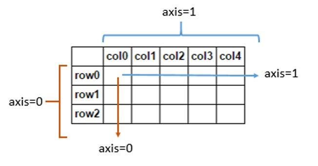

# This repository holds all the programs and resources related to deep learning
## Numpy axis ---->

## Softmax VS Sigmoid functions
### Softmax :
1. Softmax is used when the number of classes K > 2
2. Softmax equation ->

3. working principles ->

4. Softmax function image ->

### Sigmoid :
1. Sigmoid is used when we have K = 2. In other words we use sigmoid to do binary classification
2. Sigmoid equation ->

3. working principles ->

4. Sigmoid function image ->


## Softmax :
### implementation -->
#### Now as you know we are going to be working with multiple samples at the same time so let's try this again with a matrix. Here we are randomely taking a matrix of 100 samples by 5 categories
```
A = np.random.randn(100,5)
```
#### perform softmax operation on the activation
1. step 1 : exponentiate these activation (So that they are all positive)
2. step 2 : divide by the sum
   ```Now you are gonna have a problem here because you dont want to divide by the whole sum because then the whole thing is gonna sum to 1
      "answer = expA/expA.sum()"
      We want every row to sum to one for each sample. axis=1 means we want to do summision along the row
      "answer = expA/expA.sum(axis=1,keepdims=True)"
   ```

```
expA = np.exp(A)
print(f"activation after exponentiation : {expA}")

#The final result of the softmax
Result = expA/expA.sum(axis=1,keepdims=True)
print(f"step 2 answer after dividing expa/expa.sum(): {Result}")

#You can confirm that the result is a probabilities by adding them up and the sum should be 100 because each row summision should be 1 and there are
#100 samples so the final summision should be -> 100
print(f"You can confirm that the answer is a probabilities by adding them up and the sum should be 1 : {Result.sum()}")

#sum along rows = 1
print(f"sum along rows : {Result.sum(axis=1)}")
```

## Forward function :
### Running predictions on the dataset -
#### Here we are trying to do predictions without training the neural network by randomply selecting the weights for our neural network
```
#Number of inputs
D=2
#Number of hidden layers
M=3
#number of classes
K=3

#initialize the weights
#On the input side
#W1 weight matrix has to be D x M matrix
W1 = np.random.randn(D,M)
#b1 bias term
b1 = np.random.randn(M)
#On the output side
#M2 weight matrix has to be M X K matrix
W2 = np.random.randn(M,K)
#b2 bias term
b2 = np.random.randn(K)
```
#### The data we created is 3 gaussian clouds.
1. np.random.randn(Nclass, 2) + np.array([0,-2]) So the 1st gaussian cloud is gonna centered at 0,-2
2. np.random.randn(Nclass, 2) + np.array([2,2]) So the 2nd gaussian cloud is gonna centered at 2,2
3. np.random.randn(Nclass, 2) + np.array([-2,2]) So the 3rd gaussian cloud is gonna centered at -2,2
```
#let's create 500 samples per class
#So what we are gonna do is generate some gaussian clouds
Nclass = 500
#So we are gonna have 3 gaussian clouds
#np.random.randn(Nclass, 2) + np.array([0,-2]) So the 1st gaussian cloud is gonna centered at 0,-2
X1 = np.random.randn(Nclass, 2) + np.array([0,-2])
#np.random.randn(Nclass, 2) + np.array([2,2]) So the 2nd gaussian cloud is gonna centered at 2,2
X2 = np.random.randn(Nclass, 2) + np.array([2,2])
#np.random.randn(Nclass, 2) + np.array([-2,2]) So the 3rd gaussian cloud is gonna centered at -2,2
X3 = np.random.randn(Nclass, 2) + np.array([-2,2])
X = np.vstack([X1,X2,X3])
```
#### You can easily visualize the data we just created if we plot this on a scatter plot

#### Feed forward function for the neural network that has -->
1. 2 inputs
2. 3 number of hidden layers
3. 3 number of classes
```
#let's define the forward action of the neural network
#It's gonna take in x matrix , W1, b1, W2, b2
def forward(X,W1,b1,W2,b2):
    # we are gonna use sigmoid non linearity in the hidden layers
    #Z is the value at the hidden layer
    # sigmoid(-(a+b1)) --> sigmoid(-a-b1) hence exp(-X.dot(W1)-b1)
    Z = 1/(1+np.exp(-X.dot(W1)-b1))

    #Now we can calculate the softmax of the next layer
    A = Z.dot(W2) +b2
    #we exponentiate A
    expA = np.exp(A)
    #Output Y
    Y = expA/expA.sum(axis=1,keepdims = True)
    return Y
```
#### Function to calculate the classification rate
```
#define a function to calculate the classification rate
#This is gonna take in targets Y and predictions P
def classification_rate(Y,P):
    n_correct = 0
    n_total = 0
    for i in range(len(Y)):
        n_total +=1
        if Y[i]==P[i]:
            n_correct +=1
    return float(n_correct)/n_total
```
#### Python's assert statement allows you to write sanity checks in your code. These checks are known as assertions, and you can use them to test if certain assumptions remain true while you're developing your code. If any of your assertions turn false, then you have a bug in your code
```
assert(len(Predictions)==len(Y))
```
#### The final prediction of this neural network model is : -> As you can see that the prediction is exactly what we expected 1/3. This prediction score is low because we din't train the neural network model as of yet. As you know that training the model means finding the oprtimal weights for the model. But If you recall we did not do that instead we randomly selected weights for our neural network. Hence the result.
```
Classification rate for the randomly chosen weights : 0.3333333333333333
```
### Conclusion :
#### Our goal here was to learn how to do prediction using neural network and not how to train neural network. The score will go up when we eventually train the neural network and run predictions again.

## BackPropogation :
#### Diagram of BackPropogation ---->

#### BackPropogation is just a fancy name given to the process of training a neural network but in reality it's nothing but gradient descent. Which is used to find the optimal weights for the neural network
### We are going to create 3 gaussian clouds as our input data points in order to demonstrate back propogation while training the neural networks
#### Here is the code to create three gaussian clouds as an input data --->
```
#let's create 500 samples per class
  #So what we are gonna do is generate some gaussian clouds
  Nclass = 500

  #Number of inputs
  D=2
  #Number of hidden layers
  M=3
  #number of classes
  K=3

  #So we are gonna have 3 gaussian clouds
  #np.random.randn(Nclass, 2) + np.array([0,-2]) So the 1st gaussian cloud is gonna centered at 0,-2
  X1 = np.random.randn(Nclass, D) + np.array([0,-2])
  #np.random.randn(Nclass, 2) + np.array([2,2]) So the 2nd gaussian cloud is gonna centered at 2,2
  X2 = np.random.randn(Nclass, D) + np.array([2,2])
  #np.random.randn(Nclass, 2) + np.array([-2,2]) So the 3rd gaussian cloud is gonna centered at -2,2
  X3 = np.random.randn(Nclass, D) + np.array([-2,2])
  X = np.vstack([X1,X2,X3])

  #create our labels
  Y = np.array([0]*Nclass + [1]*Nclass + [2]*Nclass)
```
#### One hot encoding
```
N = len(Y)
  #Turn the targets into an indicator variable because we expect those to be either zero or one
  #where as in Y variable we represent the classes by zero to k-1
  #We need an indicator variable of size N by K
  T = np.zeros((N,K))
  #So this is like a one hot encoding for the targets
  for i in range(N):
      T[i,Y[i]] = 1
```
#### Data points of the created gaussian graph are plotted here for visualization of the data --->


### case 1 : using for loop to find derivatives
1. Step 1 create a forward function
```
#let's define the forward action of the neural network
#It's gonna take in x matrix , W1, b1, W2, b2
def forward(X,W1,b1,W2,b2):
    # we are gonna use sigmoid non linearity in the hidden layers
    #Z is the value at the hidden layer
    # sigmoid(-(a+b1)) --> sigmoid(-a-b1) hence exp(-X.dot(W1)-b1)
    Z = 1/(1+np.exp(-X.dot(W1)-b1))

    #Now we can calculate the softmax of the next layer
    A = Z.dot(W2) +b2
    #Perform softmax operation on A --> softmax(A)
    #we exponentiate A
    expA = np.exp(A)
    #Output Y
    Y = expA/expA.sum(axis=1,keepdims = True)
    #Here we are return Y and Z both because it is required to calculate the gradient descent
    return Y,Z
```
2. Step 2 Create function to calculate classification rate for the model
```
#define a function to calculate the classification rate
#This is gonna take in targets Y and predictions P
def classification_rate(Y,P):
    n_correct = 0
    n_total = 0
    for i in range(len(Y)):
        n_total +=1
        if Y[i]==P[i]:
            n_correct +=1
    return float(n_correct)/n_total
```
3. Step 3 Define a cost OR objective function for multiclass classification
```
#defining the cost function
#This takes in the targets = T and the outputs = Y
def cost(T, Y):
    tot = T * np.log(Y)
    J_cost_function = tot.sum()
    return J_cost_function
```
4. Step 4 Define the neural network architecture
```
#Number of inputs
  D=2
  #Number of hidden layers
  M=3
  #number of classes
  K=3
```
5. Step 5 Initialize the weights randomly
```
#Starting part of this is the same so we are going to randomly initialize the weights
  #randomly initialize the weights
  #On the input side
  #W1 weight matrix has to be D x M matrix
  W1 = np.random.randn(D,M)
  #b1 bias term
  b1 = np.random.randn(M)
  #On the output side
  #M2 weight matrix has to be M X K matrix
  W2 = np.random.randn(M,K)
  #b2 bias term
  b2 = np.random.randn(K)
```
6. Step 6 define the functions to calculate the derivatives with respect to the weights W1, b1, W2, b2 . {NOTE : HERE WE ARE USING PYTHON FOR LOOP FOR BETTER UNDERSTANDING}
```
#derivative function with respect to w2
#this function will take in the Z=hidden layer values , T = Targets and Y = Outputs
def derivative_w2(Z,T,Y):
    #get the shape N and K from the targets matrix
    N,K = T.shape
    #Get the number of hidden units in hidden layer from Z.shape[1]
    M = Z.shape[1]

    #slow way of doing this -> So this is directly from our derivation
    ret1 = np.zeros((M,K))
    for n in range(N):
        for m in  range(M):
            for k in range(K):
                #here we are doing T-Y because we are doing gradient ascent
                ret1[m,k] += (T[n,k] - Y[n,k])*Z[n,m]
    return ret1

#derivative with respect to b2
#This function will take in T = Targets and Y = Outputs
def derivative_b2(T,Y):
    derivation_wrt_b2 = (T-Y).sum(axis=0)
    return derivation_wrt_b2

#derivative with respect to W1
#SO this function takes in  X = the input matrix , Z = hidden values , T = Targets , Y = Outputs , W2 = Output layer weights
def derivative_w1(X, Z, T, Y, W2):
    #Get N and D from X.shape
    N,D = X.shape
    #Get M,K from W2.shape
    M,K = W2.shape

    #Slow method
    ret1 = np.zeros((D,M))
    for n in range(N):
        for k in range(K):
            for m in range(M):
                for d in range(D):
                    ret1[d,m] += (T[n,k] - Y[n,k])*W2[m,k]*Z[n,m]*(1-Z[n,m])*X[n,d]
    return ret1

#derivative with respect to b1
#This takes in T = Targets , Y = Outputs , W2 = Weights Output layer weights , Z = Hidden layer values
def derivative_b1(T, Y, W2, Z):
     derivation_wrt_b1 = ((T-Y).dot(W2.T) * Z * (1-Z)).sum(axis=0)
     return derivation_wrt_b1
```
7. Step 7 Performing back propogation to find the optimal weights for the neural network
```
'''doing back propogation '''
  learning_rate = 10e-7
  #array of cost function so that we can plot it afterwards to see the progression
  costs= []
  #now I am gonna do 500000 epochs
  for epoch in range(999999):
      #This version of the forward function not only returns the output but also returns the hidden layer
      output,hidden = forward(X,W1,b1,W2,b2)
      #every 100 epochs we are gonna calculate the cost and print it
      if (epoch % 100==0):
          #calculating cost
          c = cost(T,output)
          #calculating predictions
          P = np.argmax(output, axis = 1)
          #calculating the classification rate
          r = classification_rate(Y,P)
          print(f"cost : {c} , classification_rate : {r}")
          #append the cost to the cost array
          costs.append(c)

      #now we are going to do gradient ascent this is just the backwards of gradient descent
      W2 += learning_rate * derivative_w2(hidden, T, output)
      b2 += learning_rate * derivative_b2(T, output)
      W1 += learning_rate * derivative_w1(X, hidden, T, output, W2)
      b1 += learning_rate * derivative_b1(T, output, W2, hidden)
```
## NOTE: We don't use python for loop because it's very slow. On the other hand using numpy to solve for the vectorized form of the same equation to find the derivatives with respect to the weights is superfast. Hence using python for loop is not practical in production enviornment
### case 2 using vectorized form to calculate derivation with respect to weights using numpy
1. Step 1 create a forward function
```
#let's define the forward action of the neural network
#It's gonna take in x matrix , W1, b1, W2, b2
def forward(X,W1,b1,W2,b2):
    # we are gonna use sigmoid non linearity in the hidden layers
    #Z is the value at the hidden layer
    # sigmoid(-(a+b1)) --> sigmoid(-a-b1) hence exp(-X.dot(W1)-b1)
    Z = 1/(1+np.exp(-X.dot(W1)-b1))

    #Now we can calculate the softmax of the next layer
    A = Z.dot(W2) +b2
    #Perform softmax operation on A --> softmax(A)
    #we exponentiate A
    expA = np.exp(A)
    #Output Y
    Y = expA/expA.sum(axis=1,keepdims = True)
    #Here we are return Y and Z both because it is required to calculate the gradient descent
    return Y,Z
```
2. Step 2 Create function to calculate classification rate for the model
```
#define a function to calculate the classification rate
#This is gonna take in targets Y and predictions P
def classification_rate(Y,P):
    n_correct = 0
    n_total = 0
    for i in range(len(Y)):
        n_total +=1
        if Y[i]==P[i]:
            n_correct +=1
    return float(n_correct)/n_total
```
3. Step 3 Define a cost OR objective function for multiclass classification
```
#defining the cost function
#This takes in the targets = T and the outputs = Y
def cost(T, Y):
    tot = T * np.log(Y)
    J_cost_function = tot.sum()
    return J_cost_function
```
4. Step 4 Define the neural network architecture
```
#Number of inputs
  D=2
  #Number of hidden layers
  M=3
  #number of classes
  K=3
```
5. Step 5 Initialize the weights randomly
```
#Starting part of this is the same so we are going to randomly initialize the weights
  #randomly initialize the weights
  #On the input side
  #W1 weight matrix has to be D x M matrix
  W1 = np.random.randn(D,M)
  #b1 bias term
  b1 = np.random.randn(M)
  #On the output side
  #M2 weight matrix has to be M X K matrix
  W2 = np.random.randn(M,K)
  #b2 bias term
  b2 = np.random.randn(K)
```
6. Step 6 define the functions to calculate the derivatives with respect to the weights W1, b1, W2, b2 . {NOTE : HERE WE ARE USING NUMPY TO CALCULATE THE VECTORIZED FORM OF THE SAME EQUATION FOR FASTER PROCESSING OF THE DERIVATIVES}
```
#derivative function with respect to w2
#this function will take in the Z=hidden layer values , T = Targets and Y = Outputs
def derivative_w2(Z,T,Y):
    #get the shape N and K from the targets matrix
    N,K = T.shape
    #Get the number of hidden units in hidden layer from Z.shape[1]
    M = Z.shape[1]

    #slow way of doing this -> So this is directly from our derivation
    # ret1 = np.zeros((M,K))
    # for n in range(N):
    #     for m in  range(M):
    #         for k in range(K):
    #             #here we are doing T-Y because we are doing gradient ascent
    #             ret1[m,k] += (T[n,k] - Y[n,k])*Z[n,m]

    #fast way of doint this --> Vectorized numpy calculations
    #step 1 simplification get rid of the m
    # ret2 = np.zeros((M,K))
    # for n in range(N):
    #     for k in range(K):
    #         #here we are doing T-Y because we are doing gradient ascent
    #         #so there are 2 1D arrays on each side ret1 and Z
    #         ret2[:,k] += (T[n,k] - Y[n,k])*Z[n,:]
    #assert(np.abs(ret1 - ret2).sum() < 10e-10) --> sanity check

    #step 2 simplification get rid of the k
    # ret3 = np.zeros((M,K))
    # for n in range(N):
    #     #The all of ret3 will be the outer product of Zn , Tn - Yn
    #     ret3 += np.outer(Z[n],T[n] - Y[n])
    #assert(np.abs(ret2 - ret3).sum() < 10e-10) --> sanity check

    #step 3 simplification get rid of the loops completely
    ret4 = Z.T.dot(T-Y)
    return ret4

#derivative with respect to b2
#This function will take in T = Targets and Y = Outputs
def derivative_b2(T,Y):
    derivation_wrt_b2 = (T-Y).sum(axis=0)
    return derivation_wrt_b2

#derivative with respect to W1
#SO this function takes in  X = the input matrix , Z = hidden values , T = Targets , Y = Outputs , W2 = Output layer weights
def derivative_w1(X, Z, T, Y, W2):
    #Get N and D from X.shape
    N,D = X.shape
    #Get M,K from W2.shape
    M,K = W2.shape

    #Slow method
    # ret1 = np.zeros((D,M))
    # for n in range(N):
    #     for k in range(K):
    #         for m in range(M):
    #             for d in range(D):
    #                 ret1[d,m] += (T[n,k] - Y[n,k])*W2[m,k]*Z[n,m]*(1-Z[n,m])*X[n,d]

    #fast method --> numpy vectorized calulation method
    #delta at Z
    dz = (T-Y).dot(W2.T) * Z * (1-Z)
    delta_J_wrt_W = X.T.dot(dz)
    return delta_J_wrt_W

#derivative with respect to b1
#This takes in T = Targets , Y = Outputs , W2 = Weights Output layer weights , Z = Hidden layer values
def derivative_b1(T, Y, W2, Z):
     derivation_wrt_b1 = ((T-Y).dot(W2.T) * Z * (1-Z)).sum(axis=0)
     return derivation_wrt_b1
```
7. Step 7 Performing back propogation to find the optimal weights for the neural network
```
'''doing back propogation '''
  learning_rate = 10e-7
  #array of cost function so that we can plot it afterwards to see the progression
  costs= []
  #now I am gonna do 500000 epochs
  for epoch in range(999999):
      #This version of the forward function not only returns the output but also returns the hidden layer
      output,hidden = forward(X,W1,b1,W2,b2)
      #every 100 epochs we are gonna calculate the cost and print it
      if (epoch % 100==0):
          #calculating cost
          c = cost(T,output)
          #calculating predictions
          P = np.argmax(output, axis = 1)
          #calculating the classification rate
          r = classification_rate(Y,P)
          print(f"cost : {c} , classification_rate : {r}")
          #append the cost to the cost array
          costs.append(c)

      #now we are going to do gradient ascent this is just the backwards of gradient descent
      W2 += learning_rate * derivative_w2(hidden, T, output)
      b2 += learning_rate * derivative_b2(T, output)
      W1 += learning_rate * derivative_w1(X, hidden, T, output, W2)
      b1 += learning_rate * derivative_b1(T, output, W2, hidden)
```
#### This is the graph that represents log likelihood progress --->

#### Final cost and classification rate are as follows ---->
```
cost : -157.93332306252032 , classification_rate : 0.962
```

## Logisitc regression with Softmax :
#### As you know for multiclass classification we use Softmax and for binary classification we use Sigmoid So here we will be trying to do multiclass prediction using logistic regression via Softmax instead of sigmoid
1. Define a function for indicator matrix
```
#We are gonna need a function to get the indicator matrix from the targets
# takes in Y output and K number of classes
def y2indicator(y,K):
    N = len(y)
    indicator_matrix = np.zeros((N,K))
    #So this is like a one hot encoding for the targets
    for i in range(N):
        indicator_matrix[i,y[i]] = 1
    return indicator_matrix
```
2. Get the data
```
#Now we get our data
X,Y = get_data()
#Then shuffle our data
X,Y = shuffle(X,Y)
#convert Y to int32
Y = Y.astype(np.int32)
D = X.shape[1]
#K the number of classes assuming our classes are numbered from 0 to k-1
K = len(set(Y))
```
3. Split the data into train and test data
```
#split our data into train and test sets
#train dataset
Xtrain = X[:-100]
Ytrain = Y[:-100]
Ytrain_indicator = y2indicator(Ytrain, K)
#test dataset
Xtest = X[-100:]
Ytest = Y[-100:]
Ytest_indicator = y2indicator(Ytest, K)
```
3. Initialize the weights for the logisitc regression
```
#initialize our weights
W = np.random.randn(D, K)
b = np.zeros(K)
```
4. Define the soft max function
```
#let's define our softmax function
def softmax(a):
    expA = np.exp(a)
    #divide by sum along the
    summision = expA / expA.sum(axis=1,keepdims = True)
    return summision
```
5. Define the forward function
```
#defining forward function(X,W,b):
def forward(X,W,b):
    return softmax(X.dot(W) + b)
```
6. Define the predict funtion
```
def predict(P_Y_given_X):
    return np.argmax(P_Y_given_X,axis=1)
```
7. Define the function to calculate the classification rate. This is function is the same as binary logisitic regression classifier
```
def classification_rate(Y,P):
    return np.mean(Y==P)
```
8. Define the cross_entropy OR cost_function OR Objective_function
```
def cross_entropy(T,pY):
    return -np.mean(T*np.log(pY))
```
9. Now train the logistic regression model via gradient descent in a loop
```
#training loop starts here
#here we are gonna keep track of train costs
train_costs = []
#here we are gonna keep track of test costs
test_costs = []
learning_rate = 0.001
for i in range(99999):
    pYtrain = forward(Xtrain, W, b)
    pYtest = forward(Xtest, W, b)

    ctrain = cross_entropy(Ytrain_indicator, pYtrain)
    ctest = cross_entropy(Ytest_indicator, pYtest)
    train_costs.append(ctrain)
    test_costs.append(ctest)

    #performing gradient descent
    W -= learning_rate * Xtrain.T.dot(pYtrain - Ytrain_indicator)
    b -= learning_rate * (pYtrain - Ytrain_indicator).sum(axis=0)
    if i % 1000 == 0:
        print(f"i : {i} ; ctrain : {ctrain} ; ctest : {ctest}")
```
### Results after training a multiclass logistic regression classifier using softmax are as follows :
#### Final train and test classification rate ---->
```
Final train classification rate : 0.9175
Final test classification rate : 0.88
```
#### Final train vs test cost graph is ---->


## Prediction via neural network on E-commerce dataset
#### Everything under this is the same
```
#We are gonna need a function to get the indicator matrix from the targets
# takes in Y output and K number of classes
def y2indicator(y,K):
    N = len(y)
    indicator_matrix = np.zeros((N,K))
    #So this is like a one hot encoding for the targets
    for i in range(N):
        indicator_matrix[i,y[i]] = 1
    return indicator_matrix

#Now we get our data
X,Y = get_data()
#Then shuffle our data
X,Y = shuffle(X,Y)
#convert Y to int32
Y = Y.astype(np.int32)

#defining the neural network architecture
#Number of inputs
D=X.shape[1]
#Number of hidden layers
M=5
#number of classes
K=len(set(Y))

#split our data into train and test sets
#train dataset
Xtrain = X[:-100]
Ytrain = Y[:-100]
Ytrain_indicator = y2indicator(Ytrain, K)
#test dataset
Xtest = X[-100:]
Ytest = Y[-100:]
Ytest_indicator = y2indicator(Ytest, K)

#Now we can randomly initialize our weights for the neural networks
W1 = np.random.randn(D,M)
b1 = np.zeros(M)
W2 = np.random.randn(M,K)
b2 = np.zeros(K)
```
#### Using Softmax for multiclass classification
```
#define the sofmax function
def softmax(a):
    expA = np.exp(a)
    #divide by sum along the
    summision = expA / expA.sum(axis=1,keepdims = True)
    return summision
```
#### This we are using tanh function instead of Sigmoid function
```
#defining forward function(X,W1,b1,W2,b2):
#we have to return Z which is the value of the hidden units also along with the value of the softmax function calculation
def forward(X,W1,b1,W2,b2):
    # sigmoid
    # Z = 1 / (1 + np.exp( -(X.dot(W1) + b1) ))

    # tanh
    # Z = np.tanh(X.dot(W1) + b1)
    # Z = np.tanh(X.dot(W1)+b1) #input->hidden layers

    # relu
    Z = X.dot(W1) + b1
    Z = Z * (Z > 0)

    #Z.dot(W2) + b2 --> activation
    return softmax(Z.dot(W2) + b2),Z #softmax hidden->output layer
```
#### These functions will remain the same
```
#define the predict function
def predict(P_Y_given_X):
    return np.argmax(P_Y_given_X,axis=1)

#define the function for classification_rate
def classification_rate(Y,P):
    return np.mean(Y==P)

#function to calculate the cross_entropy for multi class classification
# T -> Targets
def cross_entropy(T,pY):
    return -np.mean(T * np.log(pY))
```
#### Training loop for the neural network
```
#training the neural network via loop
#list to store the train and test costs
train_costs = []
test_costs = []
learning_rate = 0.001
#loop for training the neural network
for i in range(99999):
    pYtrain, Ztrain = forward(Xtrain,W1,b1,W2,b2)
    pYtest, Ztest = forward(Xtest,W1,b1,W2,b2)

    #now we can calculate the cost
    ctrain = cross_entropy(Ytrain_indicator,pYtrain)
    ctest = cross_entropy(Ytest_indicator,pYtest)
    train_costs.append(ctrain)
    test_costs.append(ctest)

    #gradient descent for finding optimum weights for our neural network
    W2 -= learning_rate * Ztrain.T.dot(pYtrain - Ytrain_indicator) #[pYtrain = Output (Y)] - [Ytrain_indicator = Targets (T)]
    b2 -= learning_rate * (pYtrain - Ytrain_indicator).sum() #[pYtrain = Output (Y)] - [Ytrain_indicator = Targets (T)]
    #we need error at hidden nodes so that would be
    # derivative of tanh = (1-Ztrain*Ztrain)
    '''
    [pYtrain = Output (Y)] - [Ytrain_indicator = Targets (T)]
    dz = (Y-T).dot(W2.T) * Z * (1-Z) --> sigmoid activation function
    dZ = (Y - T).dot(W2.T) * (1-Ztrain*Ztrain) -->tanh activation function
    dZ = (Y - T).dot(W2.T) * (Z > 0) --> relu activation function
    delta_J_wrt_W = X.T.dot(dz)
    '''
    #dZ = (pYtrain - Ytrain_indicator).dot(W2.T) * (1-Ztrain*Ztrain) # activation function
    dZ = (pYtrain - Ytrain_indicator).dot(W2.T) * (Ztrain > 0) #--> relu activation function
    W1 -= learning_rate * Xtrain.T.dot(dZ)
    b1 -= learning_rate * dZ.sum(axis=0)

    if i % 1000 == 0:
        print(f" i = {i} ; ctrain = {ctrain} ; ctest = {ctest}")
```
### The output after training this neural network are as follows
#### Final train and test classification rate ---->
```
when using tanh activation function
Final train classification rate : 0.9925
Final test classification rate : 0.96

when using rel_U activation function
Final train classification rate : 1.0
Final test classification rate : 0.96
```
#### Train vs test costs graph ---->
#### when using tanh activation function -->

#### when using rel_U activation function -->

